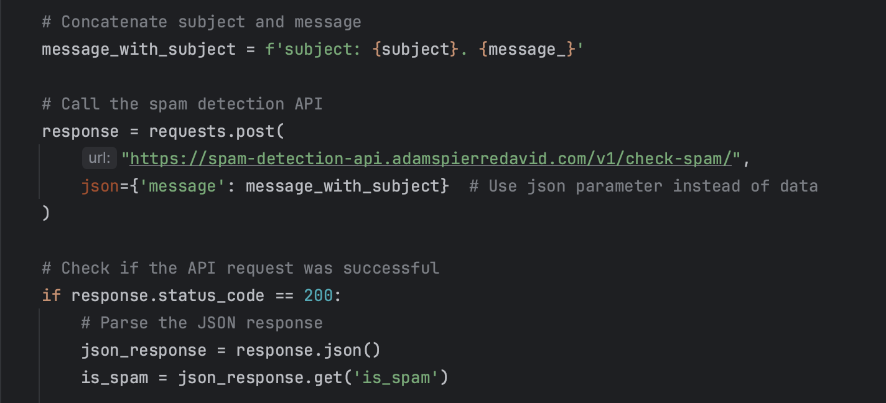

# Spam-Detector-AI


[](https://badge.fury.io/py/spam-detector-ai)
[](https://opensource.org/licenses/MIT)
[](https://github.com/adamspd/spam-detection-project/commit/main)
[](https://github.com/adamspd/spam-detection-project/issues)
[](https://github.com/adamspd/spam-detection-project/pulls)
[](https://github.com/adamspd/spam-detection-project/graphs/contributors)

Spam-Detector-AI is a Python package for detecting and filtering spam messages using Machine Learning models. The
package integrates with Django or any other project that uses python and offers three different classifiers: Naive
Bayes, Random Forest, and Support Vector Machine (SVM).

## Table of Contents

- [Installation](#installation)
- [Usage](#usage)
    - [Training the Models](#training-the-models)
    - [Tests](#tests)
    - [Making Predictions](#making-predictions)
- [Project Structure](#project-structure)
- [Contributing](#contributing)
- [License](#license)
- [Notes](#notes)

## Installation

You can install the spam detection package via pip:

```sh
pip install spam-detector-ai
```

Make sure you have the following dependencies installed:

- scikit-learn
- nltk
- pandas
- numpy

Additionally, you'll need to download the NLTK data and to do so, use the python interpreter to run the following
commands:

```python
import nltk

nltk.download('wordnet')
nltk.download('stopwords')
```

## Usage

### Training the Models

Before using the classifiers, you must train the models. Training data is loaded from a CSV file. You can find the
training data in the `data` directory in the GitHub's page of the project. The CSV file must have 3 columns: `label`,
`text` and `label_num`. The `text` column contains the content of the message to analyze and the `label` column
contains the labels `ham` or `spam` and `label_num` contains the number `0` (not spam) or `1`(spam).

The more data you have, the better the models will perform.

To train the models, run the following command:

```sh
python3 spam_detector_ai/trainer.py
```

This will train all the models and save them to the `models` directory. For now, there is 3 models:

- `naive_bayes.pkl`
- `random_forest.pkl`
- `svm.pkl`

### Tests

The test results are shown below:

#### _Model: NAIVE_BAYES_

##### Confusion Matrix:

|                  | Predicted: Ham       | Predicted: Spam      |
|------------------|----------------------|----------------------|
| **Actual: Ham**  | 1935 (True Negative) | 170 (False Positive) |
| **Actual: Spam** | 221 (False Negative) | 633 (True Positive)  |

- True Negative (TN): 1935 messages were correctly identified as ham (non-spam).
- False Positive (FP): 170 ham messages were incorrectly identified as spam.
- False Negative (FN): 221 spam messages were incorrectly identified as ham.
- True Positive (TP): 633 messages were correctly identified as spam.

##### Performance Metrics:

|              | Precision | Recall | F1-Score | Support |
|--------------|-----------|--------|----------|---------|
| Ham          | 0.90      | 0.92   | 0.91     | 2105    |
| Spam         | 0.79      | 0.74   | 0.76     | 854     |
| **Accuracy** |           |        | **0.87** | 2959    |
| Macro Avg    | 0.84      | 0.83   | 0.84     | 2959    |
| Weighted Avg | 0.87      | 0.87   | 0.87     | 2959    |

##### Accuracy: 0.8678607637715444

<br>

#### _Model: RANDOM_FOREST_

##### Confusion Matrix:

|                  | Predicted: Ham       | Predicted: Spam     |
|------------------|----------------------|---------------------|
| **Actual: Ham**  | 2067 (True Negative) | 38 (False Positive) |
| **Actual: Spam** | 36 (False Negative)  | 818 (True Positive) |

- True Negative (TN): 2067 messages were correctly identified as ham (non-spam).
- False Positive (FP): 38 ham messages were incorrectly identified as spam.
- False Negative (FN): 36 spam messages were incorrectly identified as ham.
- True Positive (TP): 818 messages were correctly identified as spam.

##### Performance Metrics:

|              | Precision | Recall | F1-Score | Support |
|--------------|-----------|--------|----------|---------|
| Ham          | 0.98      | 0.98   | 0.98     | 2105    |
| Spam         | 0.96      | 0.96   | 0.96     | 854     |
| **Accuracy** |           |        | **0.97** | 2959    |
| Macro Avg    | 0.97      | 0.97   | 0.97     | 2959    |
| Weighted Avg | 0.98      | 0.97   | 0.98     | 2959    |

##### Accuracy: 0.9749915511997297

<br>

#### _Model: SVM_

##### Confusion Matrix:

|                  | Predicted: Ham       | Predicted: Spam     |
|------------------|----------------------|---------------------|
| **Actual: Ham**  | 2080 (True Negative) | 25 (False Positive) |
| **Actual: Spam** | 41 (False Negative)  | 813 (True Positive) |

- True Negative (TN): 2080 messages were correctly identified as ham (non-spam).
- False Positive (FP): 25 ham messages were incorrectly identified as spam.
- False Negative (FN): 41 spam messages were incorrectly identified as ham.
- True Positive (TP): 813 messages were correctly identified as spam.

##### Performance Metrics:

|              | Precision | Recall | F1-Score | Support |
|--------------|-----------|--------|----------|---------|
| Ham          | 0.98      | 0.99   | 0.98     | 2105    |
| Spam         | 0.97      | 0.95   | 0.96     | 854     |
| **Accuracy** |           |        | **0.98** | 2959    |
| Macro Avg    | 0.98      | 0.97   | 0.97     | 2959    |
| Weighted Avg | 0.98      | 0.98   | 0.98     | 2959    |

##### Accuracy: 0.9773572152754308

The models that performed the best are the Random Forest and the SVM. The SVM model has a slightly better accuracy than
the Random Forest model. Knowing that all the models were not perfect, I decided to use a voting classifier to combine
the predictions of the 3 models. The voting classifier will use the majority vote to make the final prediction.

If you have trained the models on new data, you can test them by running the following command:

```sh
python test_and_tuning/test.py
```

### Making Predictions

To use the spam detector in your Django project:

1. Import the `VotingSpamDetector` from the `prediction` module.
2. Create an instance of the detector.
3. Use the `is_spam` method to check if a message is spam.

```python
from spam_detector_ai.prediction import VotingSpamDetector

# Create the spam detector
spam_detector = VotingSpamDetector()

# Check if a message is spam
message = "Enter the message here"
is_spam = spam_detector.is_spam(message)
print(f"Is spam: {is_spam}")
```

## Project Structure

- `classifiers/`: Contains the different classifiers (Naive Bayes, Random Forest, SVM).
- `data/`: Contains the sample dataset for training the classifiers.
- `loading_and_processing/`: Contains utility functions for loading and preprocessing data.
- `models/`: Contains the trained models and their vectorizers.
- `prediction/`: Contains the main spam detector class.
- `test_and_tuning/`: Contains scripts for testing and tuning the classifiers.
- `training/`: Contains scripts for training the classifiers.

## Contributing

Contributions are welcome! Please read the [contributing guidelines](CONTRIBUTING.md) before getting started.

## License

This project is licensed under the [MIT License](LICENSE).

## Notes

The project contains 3 pre-trained models that can be used directly if you want to skip the training step.
If you don't want to use the package, you can use the API that I have deployed
[here](https://spam-detection-api.adamspierredavid.com/).

The API is built with Django, and the following is an example of how I use it in a personal project:



The code: 

```python
import requests


def check_website_contact_form(request):
    message_ = request.POST.get('message')
    subject = request.POST.get('subject')
    # etc...

    # Concatenate subject and message
    message_with_subject = f'subject: {subject}. {message_}'

    # Call the spam detection API
    response = requests.post(
        "https://spam-detection-api.adamspierredavid.com/v1/check-spam/",
        json={'message': message_with_subject}  # Use json parameter instead of data
    )
    
    is_spam = False
    
    # Check if the API request was successful
    if response.status_code == 200:
        # Parse the JSON response
        json_response = response.json()
        is_spam = json_response.get('is_spam')
    
    if is_spam:
        # Do something
        pass
    else:
        # Do something else
        pass
```